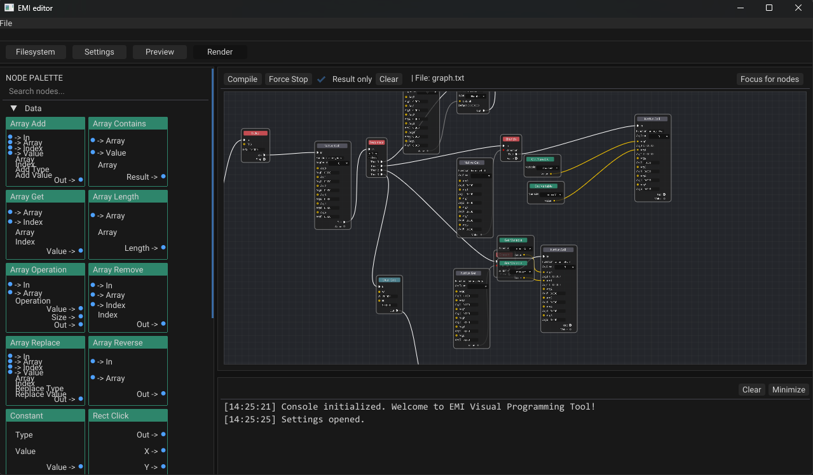

# AO Emi Visual Programming Tool

[](https://github.com/cuernatra/AO_Emi-Visual-Programming-Tool/actions/workflows/build.yml)
[](https://github.com/cuernatra/AO_Emi-Visual-Programming-Tool/actions/workflows/static-analysis.yml)
[](https://github.com/cuernatra/AO_Emi-Visual-Programming-Tool/actions/workflows/tests.yml)

Course (COMP.SE.610/620) Project

## The Pitch

AO Emi is a node-based visual programming tool and editor built in C++23.
It uses Dear ImGui via ImGui-SFML and a node editor canvas (imgui-node-editor) to let you assemble graphs, compile them to EMI-Script, and preview behavior in a small demo runtime.

EMI-Script source code: https://github.com/IlkkaTakala/EMI-Script



## Usage

### Build

Prereqs: a C++23 compiler and CMake.

```bash
cmake -S . -B build -DBUILD_SHARED_LIBS=OFF "-DCMAKE_POLICY_VERSION_MINIMUM=3.5"
cmake --build build
```

The main executable target is `emi-editor`.

### Run

Run the built `emi-editor` binary from your build output directory.

### Testing

```bash
cmake -S . -B build -DBUILD_SHARED_LIBS=OFF -DBUILD_TESTS=ON " -DCMAKE_POLICY_VERSION_MINIMUM=3.5" 
cmake --build build
ctest --test-dir build --output-on-failure
```

### Documentation

```bash
doxygen Doxyfile
```

Open `docs/index.html` (redirects to `docs/html/index.html`).

## How it works

The editor is split into two major halves:

- `src/core/`: graph data structures, node registry, and the graph compiler (turns graphs into EMI-Script AST/code).
- `src/editor/` + `src/app/`: editor state, panels, rendering, and the SFML/ImGui frame loop.

The demo preview includes small “native” functions (see `Demo/NodeGameFunctions.cpp`) used by demo graphs (e.g. A* pathfinding over a grid with editable walls).


